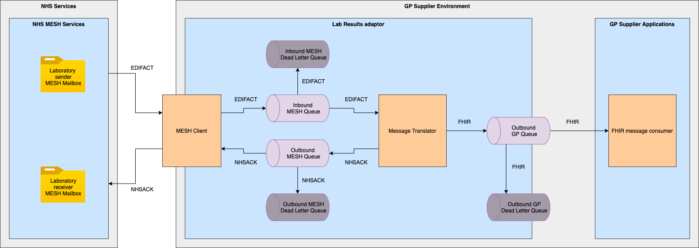
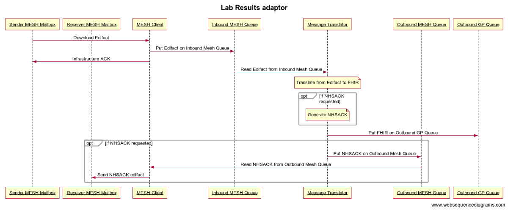

# Lab Results Adaptor

## Description

The Lab Results Adaptor hides the complexity of legacy EDIFACT and MESH messaging standards behind a simple, consistent interface aligned to current NHSD national standards. It downloads Pathology (NHS002, NHS003) and Screening (NHS004) EDIFACT messages from a MESH mailbox, translates them into FHIR STU3 Bundle resources, and exposes them to the GP System via an AMQP 1.0 queue (Outbound GP Queue). Where requested, it also returns an NHSACK (NHS001) confirmation message back to the laboratory's MESH mailbox.

## Prerequisites

- Java JDK 21 (Temurin recommended)
- IntelliJ IDEA, with the Lombok plugin installed and annotation processing enabled
- Docker / Docker Desktop
- MongoDB (via Docker image `mongo`)
- ActiveMQ (via Docker image `rmohr/activemq`)
- fake-mesh, a mock MESH API server (via Docker image `nhsdev/fake-mesh`), for local development

## Specifications

The following specification should be suitable for production deployment, but memory / compute usage should be monitored during usage:

| Resource | Specification |
|---|---|
| Compute | 2-4 vCPU (dependent on message throughput) |
| RAM | 2-4 GB (JVM min 512MB, max 2GB recommended) |
| Storage | 20 GB minimum (for Docker images and logs) |

## Design

The adaptor sits within the GP Supplier Environment and integrates two external boundaries: NHS Services 
(via NHS MESH Services) on one side, and GP Supplier Applications on the other.

The MESH Client downloads EDIFACT messages from the Laboratory sender MESH Mailbox, 
places them on the internal Inbound MESH Queue, and sends an infrastructure ACK confirming to MESH that the message 
can be deleted. If a message cannot be placed on the queue, the operation is retried on the next MESH scan cycle rather than routed to a dead letter queue. If the message fails initial structural verification (e.g. missing mandatory Interchange Header fields), it is retried up to the configured maximum before being placed on the Inbound MESH Dead Letter Queue for manual intervention.

The Message Translator reads EDIFACT messages from the Inbound MESH Queue and translates them into FHIR. 
Translated FHIR messages are placed on the Outbound GP Queue, where they are consumed by the FHIR message 
consumer in the GP Supplier Applications environment; if a message cannot be sent to the Outbound GP Queue, 
the whole EDIFACT is retried via the Inbound MESH Queue before eventually being routed to a dead letter queue after exhausting retries.

> **NOTE:** Where an NHSACK is requested, the Message Translator is designed to also generate it and place 
> it on the Outbound MESH Queue (with an Outbound MESH Dead Letter Queue for failures), with the MESH Client reading it and sending it back to the Laboratory receiver MESH Mailbox. However, NHSACK generation and sending is currently disabled in production.

### External linkages

- **NHS MESH Services:** Laboratory sender MESH Mailbox (inbound EDIFACT) and Laboratory receiver MESH Mailbox (outbound NHSACK)
- **GP Supplier Applications:** FHIR message consumer, reading from the Outbound GP Queue

### Internal linkages (within the Lab Results Adaptor)

- Inbound MESH Queue (+ Dead Letter Queue) between MESH Client and Message Translator (EDIFACT)
- Outbound MESH Queue (+ Dead Letter Queue) between Message Translator and MESH Client (NHSACK)
- Outbound GP Queue (+ Dead Letter Queue) between Message Translator and GP Supplier Applications (FHIR)

### Component diagram

Shows the Lab Results Adaptor within the GP Supplier Environment, and its position between NHS MESH Services and GP Supplier Applications. 
This illustrates the internal flow of EDIFACT and FHIR messages through the MESH Client, internal queues, Message Translator, and associated dead letter queues.



### Sequence diagram

Shows the step-by-step message flow for a single EDIFACT interchange: download from the sender MESH mailbox and queueing on the Inbound MESH Queue, 
followed by an infrastructure ACK back to the sender mailbox; translation from EDIFACT to FHIR; optional NHSACK generation; 
publishing the FHIR message to the Outbound GP Queue; and, if requested, sending the NHSACK back to the receiver MESH mailbox.


## Running the adaptor through the IDE

The adaptor configuration has sensible defaults for local development. Some overrides might be required where the "secure by default" principle takes precedence:

- `LAB_RESULTS_MESH_CERT_VALIDATION: "false"` - if using fake-mesh then certificate validation must be disabled
- `LAB_RESULTS_LOGGING_LEVEL: "DEBUG"` - consider using DEBUG logging while developing

### Pre-requisites (IntelliJ)

1. Install a Java JDK 21. Temurin is recommended.
2. Install IntelliJ.
3. Install the Lombok plugin. IntelliJ should prompt you to enable annotation processing, ensure you enable this.
4. Install Docker.

### Import the integration-adaptor-lab-results project

1. Clone this repository.
2. Open the cloned `integration-adaptor-lab-results` folder.
3. Click the pop-up that appears: (import gradle daemon).

### Verify the project structure

Project structure -> SDKs -> add new SDK -> select your installed java SDK (21.x.x) -> Project SDK -> Java 21 (21.x.x) -> Module SDK -> Java 21 (21.x.x)

### Start Dependencies

- `mongo`: MongoDB Docker images
- `rmohr/activemq`: ActiveMQ Docker images
- `nhsdev/fake-mesh`: fake-mesh (mock MESH API server) Docker images

```bash
docker compose up mongodb activemq fake-mesh
```

### Running

**From IntelliJ**

Navigate to: `IntegrationAdapterLabResultsApplication` -> right click -> Run

**Inside a container**

```bash
docker compose build lab-results
docker compose up lab-results
```

## Running the adaptor via containers

Prerequisites: Docker / Docker Desktop installed, and the repository cloned locally.

### Step 1: Start dependencies

Start MongoDB, ActiveMQ, and fake-mesh (the mock MESH API server used for local development):

```bash
docker compose up mongodb activemq fake-mesh
```

### Step 2: Build the adaptor image

```bash
docker compose build lab-results
```

### Step 3: Run the adaptor

```bash
docker compose up lab-results
```

At this point, the adaptor is running fully containerised, connected to the containerised MongoDB, ActiveMQ, and fake-mesh instances.

### Alternative: build and run everything together

If preferred, all containers (adaptor and dependencies) can be built and started in one step:

```bash
docker compose build
docker compose up
```

## Verifying the adaptor is working

A manual test script is provided to confirm the adaptor is processing messages end-to-end:

```bash
cd ./release/tests
./send_message.sh
```

This sends an example EDIFACT message to the fake-mesh container. The lab-results container should pick this up, translate it to FHIR, and place the result on the `lab_results_gp_outbound` queue.

To check the result:

1. Open the ActiveMQ admin console at [http://localhost:8161/admin/queues.jsp](http://localhost:8161/admin/queues.jsp)
2. Username: `admin`
3. Password: `admin`

The `mesh/mesh.sh` script can also be used to fetch the generated NHSACK from fake-mesh, though note NHSACK generation and sending is currently disabled in production (per OPERATING.md), so this step may not be applicable depending on configuration.

## How to run tests (unit and integration)

### Unit Tests

Runs all tests inside the `src/test` folder.

```bash
./gradlew test
```

### Integration Tests

A separate source folder `src/intTest` contains integration tests.

```bash
./gradlew integrationTest
```

### All Tests and Checks

Runs all tests (unit & integration) plus all static analysis and code style checks. 
The `--continue` flag ensures all tests and checks run even if one fails partway through.

```bash
./gradlew check --continue
```

### Quality Checks Only

Runs Spotbugs and Checkstyle static analysis to find potential bugs and confirm code style conforms to the Java Coding Standards.

```bash
./gradlew check -x test -x integrationTest
```

### Checkstyle Checks

```bash
./gradlew checkstyleIntTest checkstyleMain checkstyleTest
```

### Spotbugs Checks

```bash
./gradlew spotbugsMain
```

`spotbugsMain` is the only Spotbugs task run as part of `./gradlew check`.

### All Tests and Checks (excluding Spotbugs/Checkstyle)

```bash
./gradlew check -x spotbugsMain -x spotbugsIntTest -x spotbugsTest -x checkstyleMain -x checkstyleIntTest -x checkstyleTest
```

## Using static analysis tools

### Checkstyle

```bash
./gradlew checkstyleIntTest checkstyleMain checkstyleTest
```

This runs against main, test, and intTest source sets and checks that code style conforms to the Java Coding Standards.

### Spotbugs

```bash
./gradlew spotbugsMain
```

Static analysis to find potential bugs. Note that `spotbugsMain` is the only Spotbugs task run by default as part of `./gradlew check`.

### Both, without running tests

```bash
./gradlew check -x test -x integrationTest
```

## CI / CD Pipeline using GitHub Actions

### Stage 1: PR Opened/Updated or Push to main

**Workflow file:** `.github/workflows/build.yml`

**Trigger:**

- Pull Request to `main` (opened, synchronized, reopened)
- Push to `main` branch

**Execution:**

1. `generate-build-id` job runs first — creates a unique build tag via `create_build_id.sh`, based on event type (PR vs push) and the run number/commit SHA.
2. `tests` job calls the reusable `test.yml` workflow, which:
    - Spins up an Ubuntu container (`ubuntu-latest`)
    - Checks out code
    - Sets up Java 21 (Temurin)
    - Runs 4 jobs:
        - `checkstyle` — runs `checkStyleMain checkstyleTest checkstyleIntTest`
        - `spotbugs` — runs `spotbugsMain spotbugsTest spotbugsIntTest`
        - `unit-tests` — depends on both checkstyle and spotbugs; runs `./gradlew test --parallel --build-cache`
        - `integration-tests` — depends on both checkstyle and spotbugs; builds a Docker image from `Dockerfile.tests`, 
        - runs it with the Docker socket mounted, then runs `./gradlew integrationTest --parallel --build-cache`
    - Each job uploads its test/analysis report as a build artifact, and posts a test summary for unit and integration tests
3. If all jobs succeed, `publish-docker-images` calls the reusable `publish.yml` workflow, which:
    - Assumes an AWS IAM role via OIDC (`configure-aws-credentials`)
    - Builds the Docker image from `Dockerfile`
    - Tags the image as `{aws_account}.dkr.ecr.{region}.amazonaws.com/lab-results:{build_id}`
    - Logs into AWS ECR and pushes the image
    - Logs out of ECR to clean up credentials
4. If the trigger was a PR, a `comment` job posts a PR comment confirming the image was built and published, including the Build ID.

**Pipeline status:**

- All jobs pass → image published to ECR
- checkstyle or spotbugs fails → `unit-tests` and `integration-tests` are skipped (both depend on `[checkstyle, spotbugs]`)
- Any test failure → build stops; PR checks marked as failed

### Stage 2: Release (Manual GitHub Release)

**Workflow file:** `.github/workflows/release.yml`

**Trigger:** GitHub Release published (manual action)

**Execution:**

- Delegates to a reusable workflow from NHS Digital's `integration-adaptor-actions` repository (`release-adaptor-container-image.yml`)
- Retags the image as `nia-lab-results-adaptor:{release_tag}`
- Uses `secrets: inherit` to pass through whatever secrets the reusable workflow requires

> **Note:** the reusable workflow itself (in `integration-adaptor-actions`) wasn't provided, 
> so exact steps within it — e.g. DockerHub push mechanics, artifact attachment — aren't verifiable from what's available here.

### Accessing Build Artifacts

**Via GitHub UI:**

1. Go to the PR → "Checks" tab
2. Open the relevant workflow run
3. Download artifacts — each job (checkstyle, spotbugs, unit-tests, integration-tests) uploads its own report as a separate artifact

**Docker image tag format:**

```
{aws_account}.dkr.ecr.{region}.amazonaws.com/lab-results:{build_id}
```

### Pre-Commit Local Validation

Before pushing, run locally to catch issues early:

```bash
# Checkstyle
./gradlew checkStyleMain checkstyleTest checkstyleIntTest

# Spotbugs
./gradlew spotbugsMain spotbugsTest spotbugsIntTest

# All tests and checks
./gradlew check --continue
```

> **Please NOTE:** Every PR produces a testable image. Opening or updating a PR against `main` automatically 
> builds a Docker image and publishes it to AWS ECR, tagged with a build ID unique to that PR (e.g. `PR-456-a1b2c3d`). 
> This means a working, deployable image exists for every PR without needing to merge first. 
> The pipeline posts a comment on the PR with the exact Build ID/tag, which can then be used to pull and deploy 
> that image (e.g. to PTL) for testing before the change is merged.

## Releasing and Versioning

To do a release of any adaptor, first ensure that the CHANGELOG file is up to date and that the unreleased commits 
are classified under the correct type of change (e.g. `#Fixed` for bugs and so on). 
Then, click on **Releases** and **Draft new release**. 
Consider whether the release you are about to do is a major or a minor one, and carry on semantic versioning accordingly, 
keeping in mind what this means for the customers who will have to upgrade to the new release.

Once you have assessed the above, specify a tag version to use (e.g. `0.11`), 
with the target being the latest commit using the options available. 
Click on the **Generate release notes** button and this will list all the current changes from the recent commit.